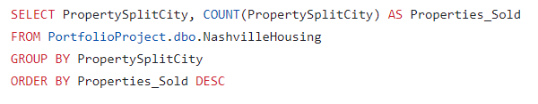
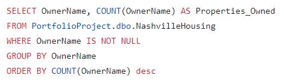
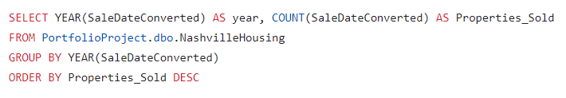
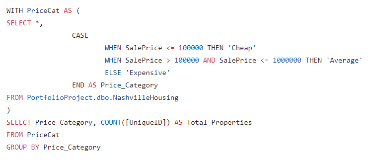

# Nashville Housing 

<h2>Table of Contents</h2>

- [Project Overview](#project-overview)
- [Data Sources](#data-sources)
- [Tools](#tools)
- [Data Cleaning Steps](#data-cleaning-steps)

<h2>Project Overview</h2>
This project aims to tramsform raw data in SQL to make it more usable for analysis.

<h2>Data Sources</h2>
The dataset used for this project is the "Nashville_Housing.xlsx" file, containing detailed information about Nashville's real estate market.

<h2>Tools</h2>

- SQL Server

<h2>Data Cleaning Steps</h2>

1. Data loading and inspection.
2. Date Format Standardization: Converting the "SaleDate" column to a consistent date format and creates a new column "SaleDateConverted".
---

---

3. Populating Property Address Data: Filling missing property addresses based on ParcelID matches with non-null addresses.

---

---

4. Breaking Out Property Address: Splitting the "Property Address" column into individual columns for address, city, and state.

---

---
5. Breaking Out Owner Address: Dividing the "Owner Address" column into columns for address, city, and state.

---

---
6. Changing 'Y' and 'N' to 'Yes' and 'No': Replacing 'Y' with 'Yes' and 'N' with 'No' in the "SoldAsVacant" column.

---

---
7. Removing Duplicates.

---

---
8. Deleting Unused Columns.

---

--- 

<h2>Exploratory Data Analysis</h2>

1. Properties per City: Counting the number of properties sold per city and presenting the data in descending order of properties sold.
---

---

2. Properties per Owner: Counting the number of properties owned by each owner, excluding cases with null owner names.

---

---

3. Sold Properties per Year: Counting the number of properties sold in each year and presenting the data in descending order.

---

---
4. Creating Price Categories: Dividing the data into price categories ("Cheap," "Average," "Expensive") based on the SalePrice column and counting properties in each category.

---

